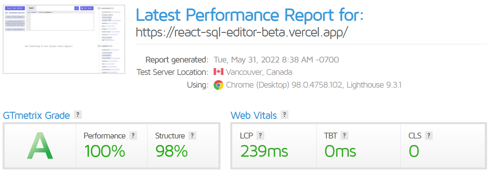
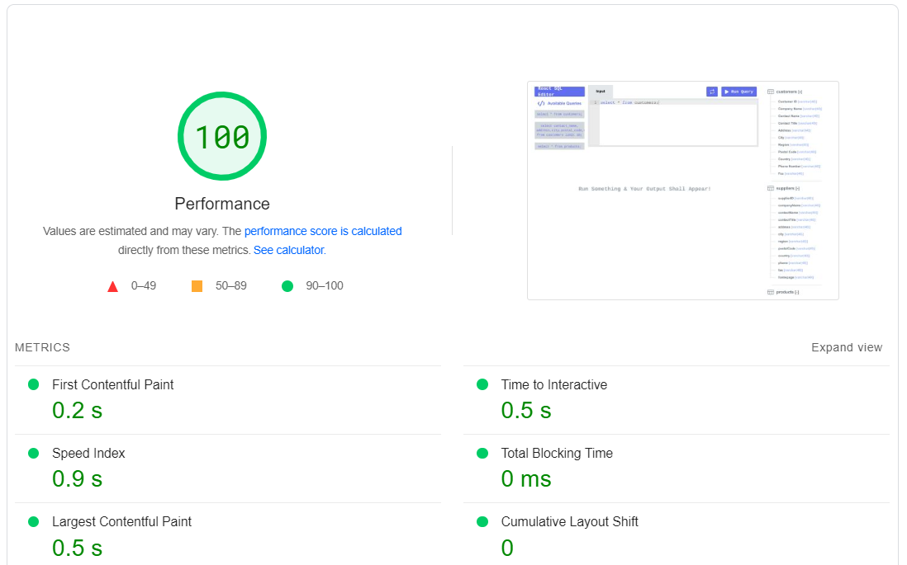
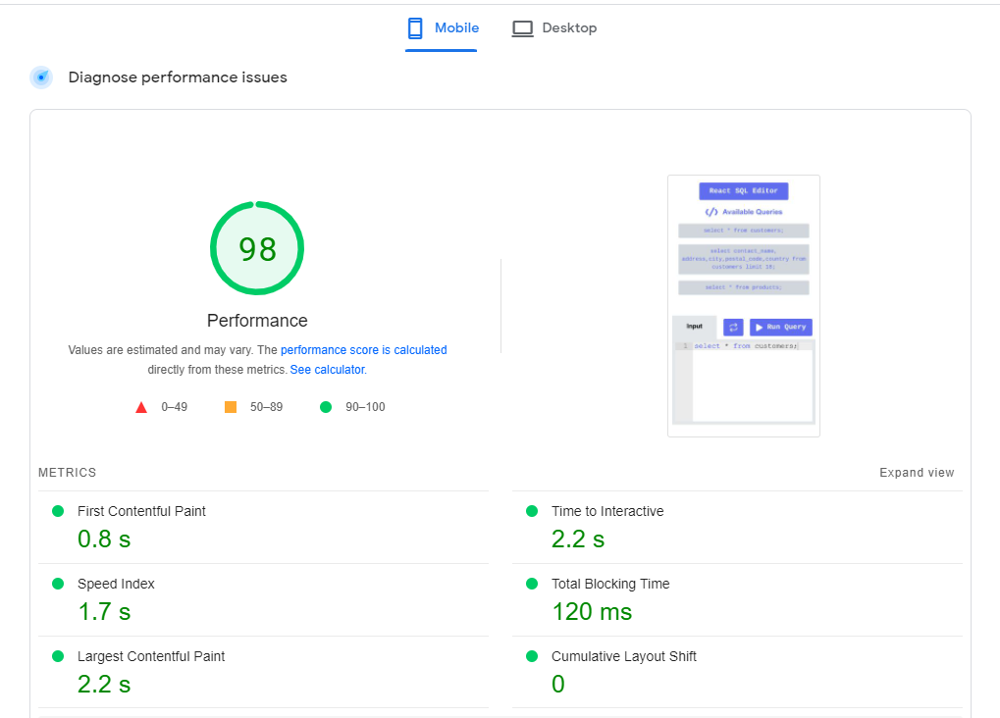
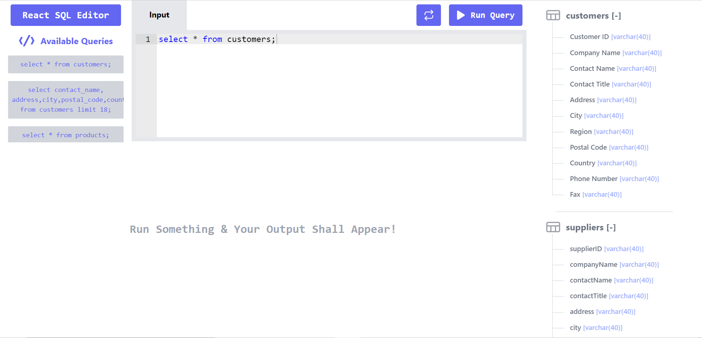

# 💻 REACT SQL Editor

## 📚 Description

Create, design and implement a web-based application capable of running SQL queries and displaying the results of said query. The application must include a space which accepts SQL queries in the form of user inputs, then runs the given query, and displays the result within the application.

This is a REACT SQL Editor built using ReactJs and TailwindCSS, featuring a modern UI with dark/light mode support and real-time query execution.

## 👨‍💻 Live Demo

<a href="https://github.com/poonam17122004/editor" target="blank">

</a>

Try out the website : [REACT SQL Editor](https://poonam17122004.github.io/editor/)

## 👨‍🔧 Tech Stack


## ⚙️ Dependencies

- **_react-ace_**: Code editor for SQL queries
- **_react-csv_**: CSV export functionality
- **_react-hot-toast_**: Toast notifications
- **_tailwind-scrollbar-hide_**: Custom scrollbar styling

## 🏗️ Project Structure

```
src/
├── components/
│   ├── DataStore/           # JSON data files
│   │   ├── customers.json
│   │   ├── suppliers.json
│   │   ├── products.json
│   │   └── select_customer.json
│   ├── TableDrawer/         # Table metadata components
│   │   ├── DataDraw.js
│   │   ├── TablePopup.js
│   │   ├── TableStructure.js
│   │   └── TableStructure.css
│   ├── Buttons.js           # Query execution controls
│   ├── PredefinedQuery.js   # Preset SQL queries
│   ├── SqlEditor.js         # SQL code editor
│   ├── Table.js             # Results display
│   └── TableUI.js           # Table UI components
├── App.js                    # Main application component
├── ThemeContext.js          # Theme management
└── index.js                 # Application entry point
```

## 📊 Entity Relationship Diagram

View the detailed ER diagram of the application: [ER Diagram](https://drive.google.com/file/d/1qcsPnwbwmsDy-MuuXtf4OjgJkmN5cCpO/view?usp=sharing)

## 👨‍💻 Features

:white_check_mark: **SQL Query Editor**
- Syntax highlighting
- Auto-completion
- Real-time query execution
- Error handling with toast notifications

:white_check_mark: **Predefined Queries**
- Quick access to common queries
- Sample queries for learning
- Customizable preset queries

:white_check_mark: **Table Management**
- View table structure
- Explore table data
- Sort and filter results
- CSV export functionality

:white_check_mark: **UI/UX Features**
- Dark/Light mode support
- Responsive design
- Toast notifications
- Loading states
- Error handling

## ✍️ Predefined SQL Queries

- `select * from customers;`
- `select * from suppliers;`
- `select * from products;`
- `select contact_name, address, city, postal_code, country from customers limit 18;`

## ⏱ Performance Metrics

### Page Load Time
- Desktop: 0.4s to 0.6s
- Mobile: Optimized for various devices

### Performance Reports


### [web.dev Report](https://pagespeed.web.dev/)

Laptop performance view


Mobile performance view


## 🪜 Optimization Steps

1. **Performance Optimization**
   - Used Lighthouse DevTools Extension
   - Implemented code splitting
   - Optimized bundle size
   - Used GitHub Pages for deployment

2. **UI/UX Optimization**
   - Implemented responsive design
   - Added loading states
   - Optimized table rendering
   - Enhanced error handling

## Available Scripts

### `npm install`
Installs all project dependencies.

### `npm start`
Runs the app in development mode at [http://localhost:3000](http://localhost:3000).

### `npm run build`
Creates an optimized production build.

### `npm run deploy`
Deploys the app to GitHub Pages.

## 🚀 Project Output



## 🔄 Data Flow

1. User enters SQL query or selects predefined query
2. Query is processed and executed
3. Results are fetched from JSON data store
4. Results are displayed in the table component
5. Table metadata is shown in the sidebar

## 🎨 Theme Support

- Dark mode for reduced eye strain
- Light mode for better visibility
- Theme preference persistence
- Smooth theme transitions

## 📱 Responsive Design

- Optimized for desktop and mobile
- Adaptive layout
- Touch-friendly controls
- Responsive table display
